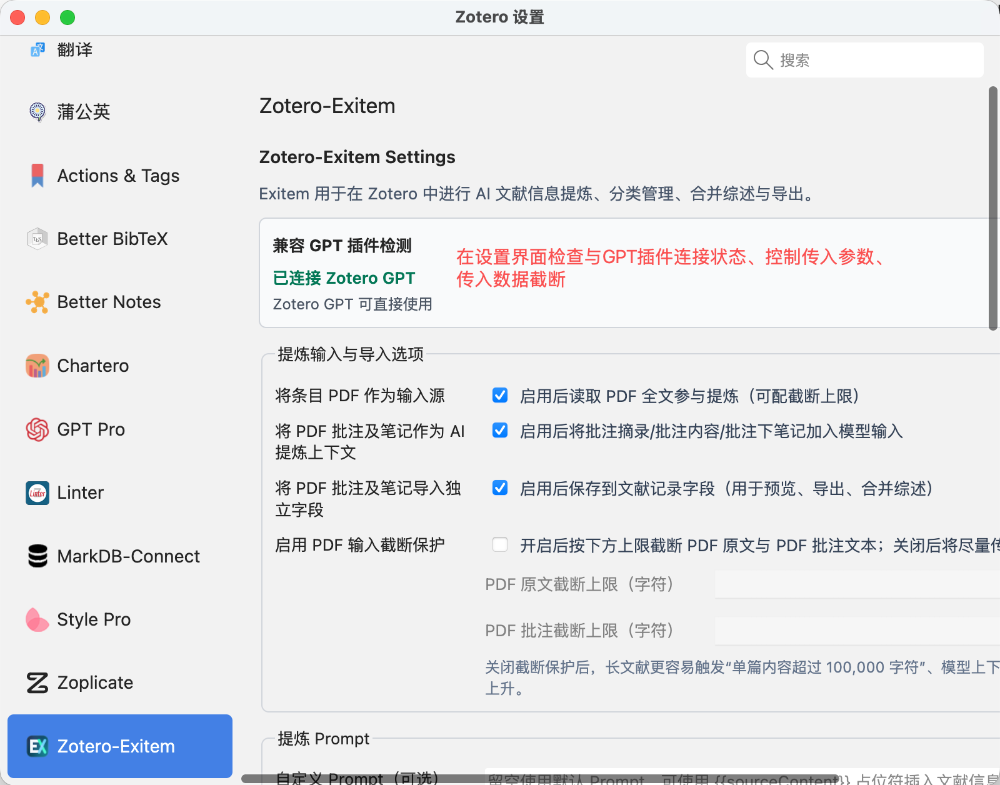
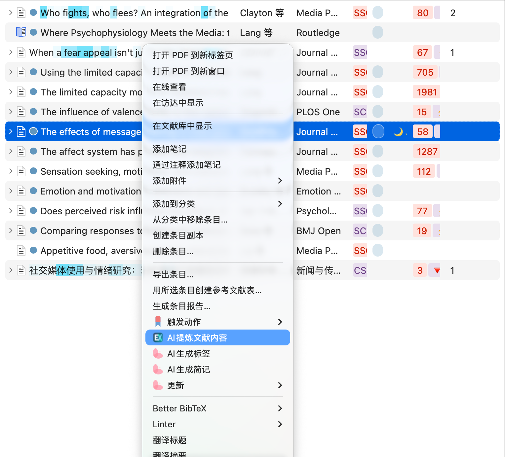
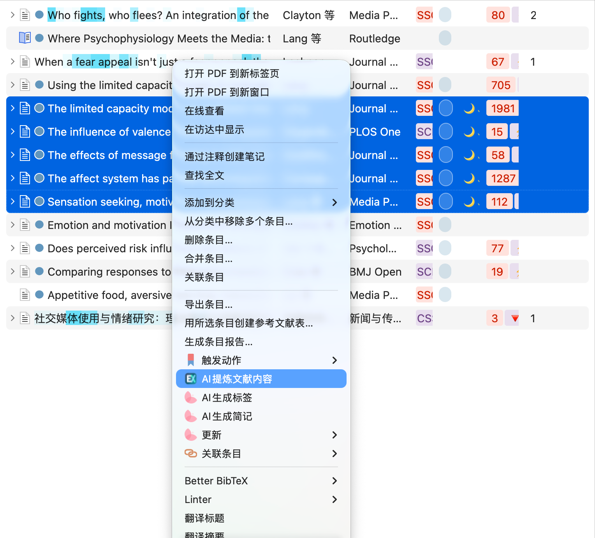
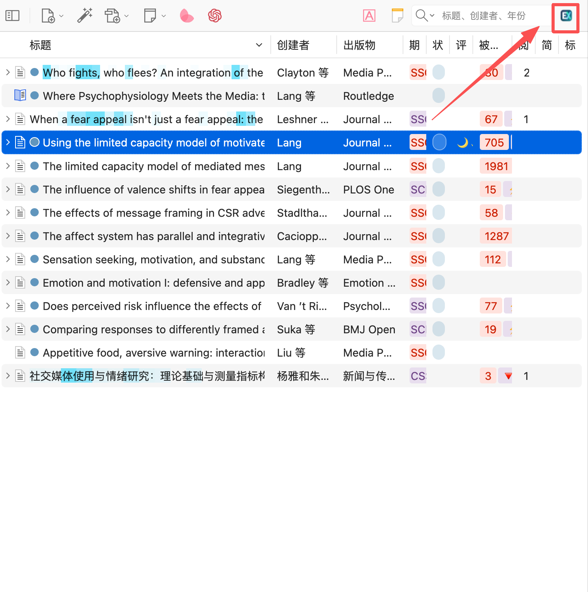
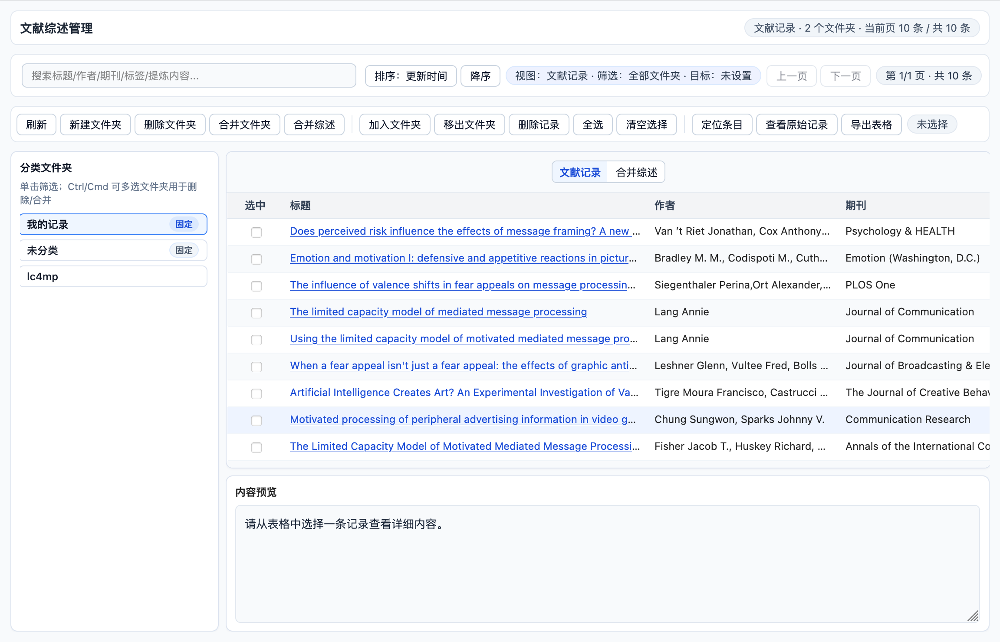
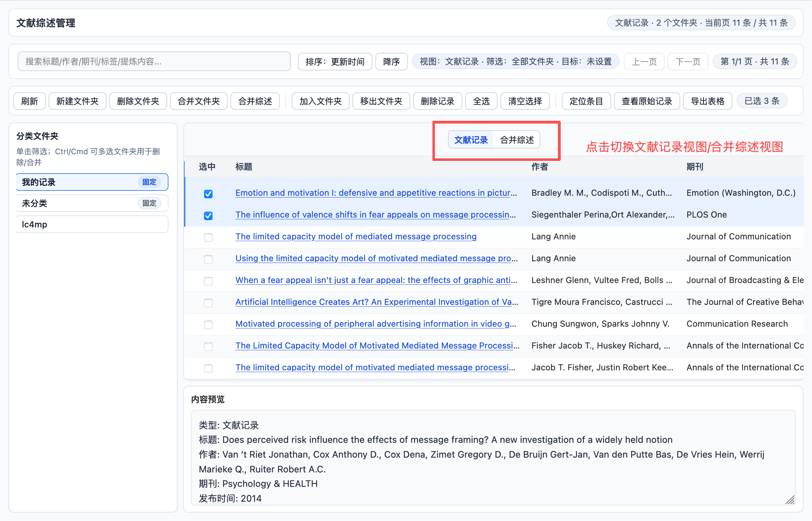
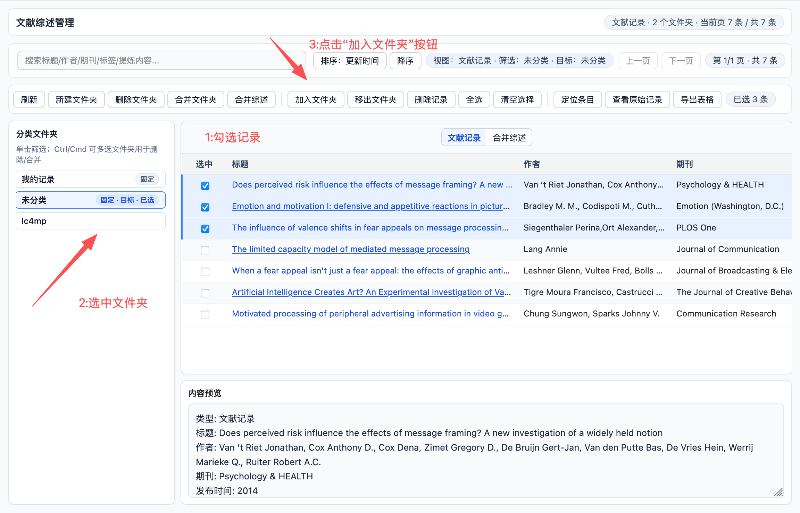
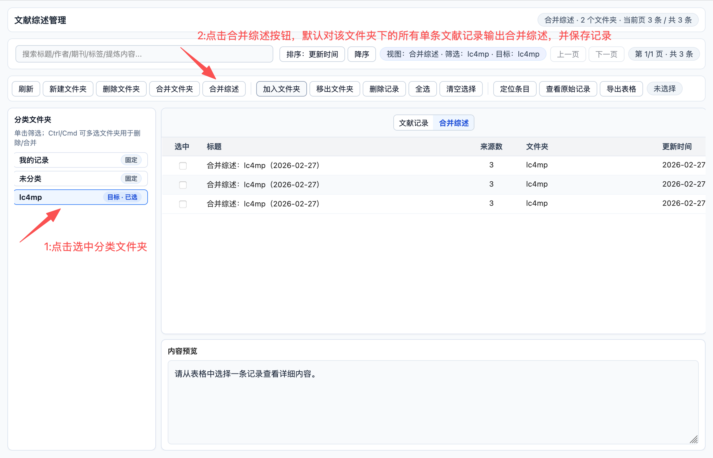
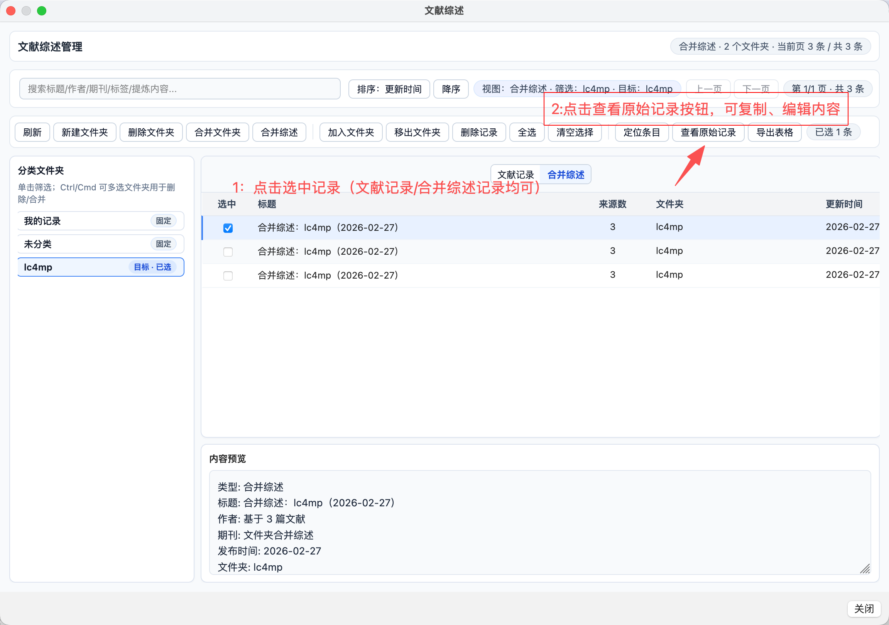
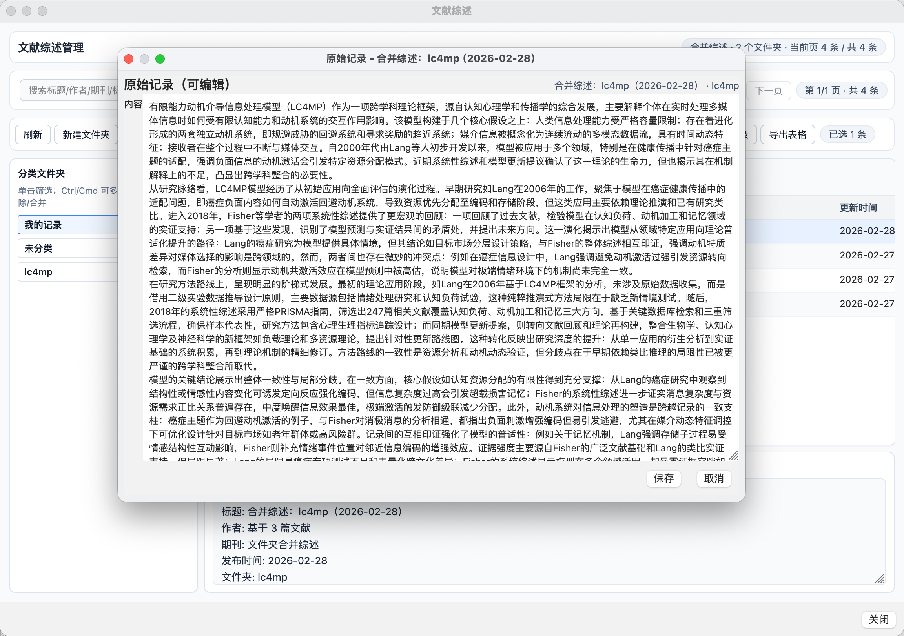

# Zotero-Exitem

Zotero-Exitem 是一款用于 Zotero 的 AI 文献信息提炼、综述管理、合并综述与导出插件。

[English](../README.md) | [简体中文](README-zhCN.md) | [Français](README-frFR.md)

## 插件icon预览

## 预装条件

- Zotero 8
- 已安装并完成 `zotero-gpt` 配置：
  - 项目地址：https://github.com/MuiseDestiny/zotero-gpt
  - 中文配置说明：https://zotero-chinese.com/user-guide/plugins/zotero-gpt
- 若要使用 PDF 相关处理能力，`zotero-gpt` 中必须同时配置：
  - 主模型（聊天/补全模型）
  - Embedding 模型

## 安装方法

1. 下载本项目发布或构建产物中的 `.xpi` 文件。
2. 打开 Zotero：`工具` -> `插件` -> 右上角齿轮 -> `Install Plugin From File...`
3. 选择 `zotero-exitem.xpi` 并安装。
4. 重启 Zotero。

## 操作教程（图文）

在一个文献综述的流程中，你可以先选中用AI生成文章的单条提炼摘要，参考摘要阅读文章，并进行批注后，再次执行单条提炼的操作，划线和批注的笔记会自动同步到AI提炼内容字段、并作为摘要生成来源，避免遗漏pdf中的重要信息。

下面给出一条完整流程：`首选项配置` -> `单条/批量提炼` -> `综述管理` -> `合并综述` -> `编辑与导出`。

### 1. 首次使用先检查 GPT 连接与提炼输入策略

- 进入 `设置 -> Zotero-Exitem`。
- 先确认“兼容 GPT 插件检测”为已连接状态。
- 根据你的使用习惯配置提炼输入项：是否读取 PDF 正文、是否带入 PDF 批注/批注笔记、是否将批注写入独立字段。
- Exitem注重用户输入信息，将pdf中用户划线内容、用户批注的笔记作为重要参数进行存储，并作为综述来源

### 2. 配置提炼 Prompt 与合并综述 Prompt

- 在首选项中编辑自定义 Prompt（提炼与合并综述都支持）。
- 点击 `保存 Prompt 配置` 保存当前设置。
- Prompt 仅影响 AI 提炼与合并综述的输出内容，不再控制“文献记录”表格列显示。

### 3. 单条文献提炼

- 在 Zotero 主界面中选中一条文献，右键菜单点击 `AI提炼文献内容`。
- 插件会调用已配置的 `zotero-gpt` 模型执行提炼。
- 提炼过程使用单个进度窗实时显示阶段；成功后自动保存到 `我的记录` 文件夹。

### 4. 批量文献提炼（单次最多 5 篇）

- 在主界面多选文献后，右键点击 `AI提炼文献内容`。
- 建议先确认所选文献都具备可用元数据与 PDF，再执行批量提炼。

### 5. 打开文献综述管理页面

- 点击 Zotero 顶部工具栏中的 Exitem 图标进入管理页。
- 管理页会以内嵌标签页的形式在 Zotero 主界面中打开。

### 6. 熟悉管理页：文献记录视图与基础操作

- 左侧是分类文件夹，中间是记录列表，底部是内容预览。
- 顶部工具栏支持刷新、文件夹管理、记录增删、编辑记录、生成笔记、导出表格等操作。

### 7. 切换“文献记录 / 合并综述”视图

- 在管理页中通过切换按钮查看文献记录或合并综述记录。

### 8. 将文献记录归类到目标文件夹

- 在文献记录视图中勾选记录。
- 在左侧选中文件夹后点击 `加入文件夹`，可批量归类。

### 9. 执行“合并综述”

- 先选中文件夹，再点击 `合并综述`。
- 插件会默认使用该文件夹下的单条文献记录生成一条合并综述记录。

### 10. 查看并编辑记录（文献记录/合并综述均可）

- 在列表勾选目标记录，点击 `编辑记录`。
- 可按字段直接修订提炼内容后保存，便于后续复用、导出与生成原生笔记。

### 11. 生成 Zotero 原生笔记

- 在 `文献记录` 视图中勾选一条或多条记录，点击 `生成笔记`。
- 插件会在每条记录对应的 Zotero 条目下创建原生子笔记，不会额外生成独立文件。
- 笔记内容会基于当前 Exitem 记录生成，自动整理为适合阅读与继续编辑的 Markdown 结构后写入 Zotero。
- 生成成功后，这些笔记会直接作为 Zotero 原生数据持久化保存，可继续在 Zotero 笔记体系中使用。

### 12. 导出结果

- 在管理页中按当前视图与筛选条件点击 `导出表格`，可导出 CSV 用于二次分析或写作整理。

## 当前功能

- 在 Zotero 条目右键菜单触发 `AI提炼文献内容`
- 单篇提炼：
  - 使用单个进度窗实时显示提炼阶段
  - 成功后自动保存到 `我的记录` 文件夹
- 批量提炼：
  - 单次最多 5 篇
  - 成功结果自动保存到目标文件夹，并打开文献综述管理界面
- 提炼输入组成可配置：
  - 元数据、摘要、笔记
  - 可选 PDF 全文
  - 可选 PDF 批注与批注下笔记
  - 可选将 PDF 批注文本导入独立字段
- Prompt 系统：
  - 支持自定义提炼 Prompt
  - 支持自定义合并综述 Prompt（`合并综述`）
  - 首选项支持 `保存 Prompt 配置`
- 文献综述管理界面：
  - 工具栏按钮入口，以 Zotero 内嵌标签页打开
  - 双视图：`文献记录` 与 `合并综述`
  - 固定视图切换控件和记录详情预览面板
  - `文献记录` 视图使用固定字段列展示提炼结果
- 文件夹与记录管理：
  - 新建/删除/合并文件夹
  - 记录加入/移出文件夹（支持同一记录归属多个文件夹）
  - 搜索、排序、多选与批量删除
  - 标题列支持跳转回 Zotero 原条目
- 合并综述与导出：
  - 按文件夹执行“合并综述”，并提供进度反馈
  - 合并综述记录保留来源追踪：`sourceRecordIDs`、`sourceZoteroItemIDs`
  - 支持在 `文献记录` 视图下批量创建 Zotero 原生子笔记
  - 笔记内容基于当前 Exitem 记录生成，并原生持久化保存到 Zotero 条目下
  - 支持记录内容查看与编辑
  - 按当前视图与筛选范围导出 CSV
- 存储：
  - Zotero 数据目录独立 JSON 文件：`exitem-review-store.json`
  - 本地事件日志（提炼、综述、导出等）

## 接口路径

- 当前 AI 调用链路为桥接已安装的 `zotero-gpt` 运行时与配置。
